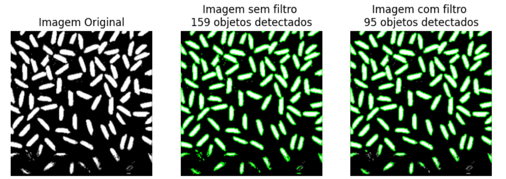
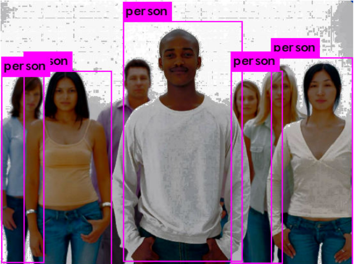

# Detecção de Objetos e Classificação de Carros com Deep Learning

Este repositório contém a implementação de métodos de contornos de objetos, YOLOv3 para detecção de pessoas e Deep Learng
CNN em classificação de carros.

## Download de arquivos
Para utilizar esse repositório é necessário realizar o download deste dataset disponível
[neste link](https://www.kaggle.com/datasets/jessicali9530/stanford-cars-dataset). Este dataset contém imagens de diferentes carros
que será necessário para reconhecimento de algumas classes. 
- O arquivo baixado com as imagens deve ser descompactado dentro da pasta "dataset_bmw" (já presente no repositório, não é necessário criá-la)

## Detecção de objetos

No arquivo q01_detecção.ipynb, são utilizadas as seguintes técnicas:

- Filtro Gaussiano: É aplicado para suavizar a imagem, o que ajuda na redução de ruídos.
- Thresholding: Um limiar é aplicado para segmentar a imagem, destacando os objetos de interesse.
- Detecção de Contornos: Os contornos dos objetos são detectados utilizando a função findContours do OpenCV.

#### Resultado:
Na primeira imagem (à esquerda) é ilustrado a imagem original sem qualquer processamento digital. A segunda imagem é a 
detecção de todos os objetos presentes na imagem, incluindo ruído. E a terceira imagem, possui um valor menor detecções 
devido a redução de ruídos, resultando na detecção de componentes de área significativa.

## Detecção de pessoas

No arquivo q02_yolov3_tiny.ipynb, é utilizado YOLOv3.

YOLOv3-tiny é uma versão simplificada e mais rápida do modelo YOLOv3, projetada para detecção de objetos em tempo real, 
mesmo em dispositivos com menor poder de processamento, como dispositivos móveis ou embarcados. Para detecção de pessoas, 
YOLOv3-tiny utiliza uma rede neural convolucional com menos camadas, mantendo a precisão adequada para identificar pessoas 
em imagens ou vídeos.

#### Resultado:
A imagem foi submetida ao pré-processamento de equalização a fim de destacar as pessoas do fundo da imagem e elevar o [
grau de confiança da detecção de "pessoa".

## Classificador de Carros

No arquivo q03_deep_learning.ipynb, é utilizado CNN para a classificação das classes 3, 4, 5 e classe indefinida.

A estrutura da rede:

- Uma camada convolucional (Conv2D) com 32 filtros, cada um de tamanho 3x3, e função de ativação ReLU. A entrada tem as 
dimensões especificadas por img_size com 3 canais (cores).
- Uma camada de pooling (MaxPooling2D) que reduz a dimensionalidade.
- Camada convolucional com 64 filtros e função de ativação ReLU.
- Camada de pooling.
- Camada de achatamento (Flatten) que transforma os dados 2D em um vetor 1D.
- Camada totalmente conectada (Dense) com 128 neurônios e ativação ReLU.
- Uma última camada Dense com um número de neurônios igual ao número de classes (len(cls)), com função de ativação softmax, que produz as probabilidades de cada classe.

#### Resultado:
Do total de imagens (171 imagens das classes 3,4,5 e indefinida), 70% é para treino e 30% para teste. 
 Obs.: O banco de imagens possui umm número maior de imagens porém, apenas 171 imagens foram utilizadas por estarem 
previamente rotuladas corretamente no arquivo cardatasettrain.csv. As demais imagens disponíveis no banco original não 
possuem uma rotulação de correspondên correta entre classe e imagem do carro.

Como resultado da classificação usando CNN (10 épocas):
Test accuracy: 0.5961 (aprox.)

